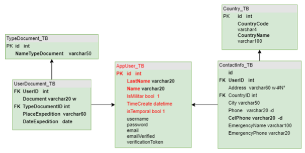

# Prueba Tecnica Needzair - Desarrollador Backend

Esta prueba evalúa su conocimiento en programación y está dividida en 2 partes, una de persistencia de datos y otra de visualización para crear un formulario de registro de usuarios con validación de formato de datos y duplicidad.

Para la persistencia de datos se pide usar el framework loopback.js (version3+) para crear los siguientes modelos con sus respectivas relaciones, (tener en cuenta que el modelo AppUser hereda del modelo por defecto User).

Se necesita crear un único endpoint (Remote methods) que permita registrar la información básica del usuario, un documento de identidad y un registro de contacto, realizando las validaciones pertinentes para evitar usuarios duplicados y almacenar de forma segura la contrasena.

El frontend se encuentra en el directorio principal, mientras que el backend esta en el directorio /server.

